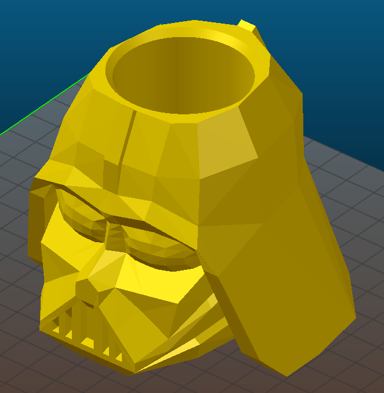
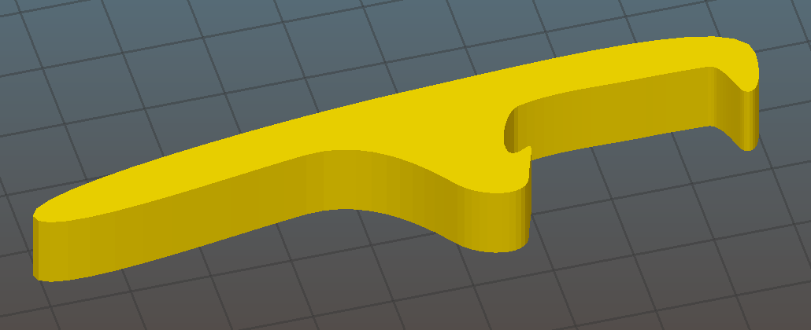
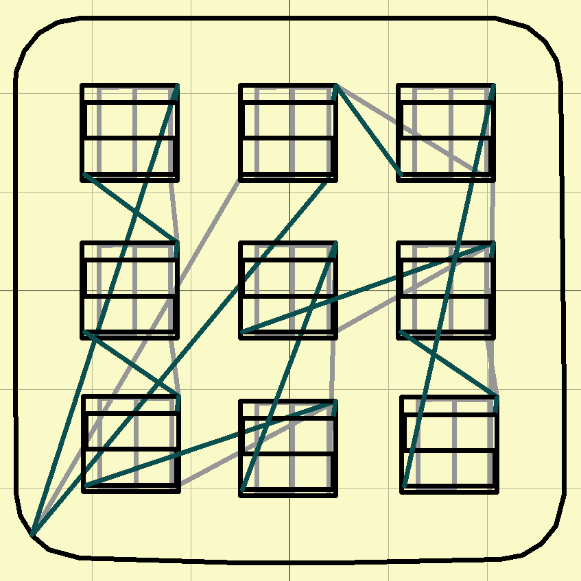
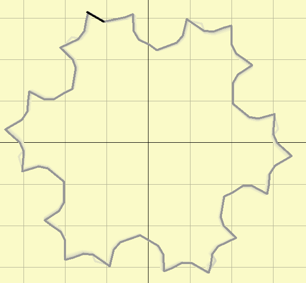

# B171A-Slicing-Assignment

Vaším dnešním úkolem bude naslicovat několik modelů v aplikaci Slic3r.
Abyste ale nezačínali s prázdnou máme pro vás jako dárek config bundle,
který si importujte do Slic3ru. Ve Slic3ru používáme Expert mód.
File -> Preferences -> Mode.

  * [config_bundle](slic3r_config_bundle.ini)
  
Tiskárnu mějte nastavenou RebeliX a filament ABS Esun 1.75mm z config bundelu.
Po jednotlivých vygenerováních gcodu prozkoumejte výstup jednotlivých nastavení
v panelu Preview (dole ve Slic3ru).

První z modelů je [bulbasaur.stl](bulbasaur.stl)
  (CC BY-NC-SA 3.0 [FLOWALISTIK](https://www.thingiverse.com/thing:327753)) s parametry

  * 5 perimetrů vertikálního shellu, 4 plné dolní vrstvy a 3 horní
  * Rychlost tisku perimetrů je 45 mm/s
  * Raft o 3 vrstvách
  * Infill typu Honeycomb s hustotou 15%
  * Teplota Bedu je při první vrstvě 79°C
  

Druhý je držák na tužky Darth Vadera -[vader_cup_v03.stl](vader_cup_v03.stl)
  (CC BY-NC 3.0 [tmasantos](https://www.thingiverse.com/thing:1396307))
  * Výška jedné vrstvy je 0.35mm z toho první vrstva je 0.36mm
  * Rychlost tisku infillu je 50mm/s, perimetry tiskneme s rychlostí 40mm/s
  * Chceme nechat vygenerovat support
  * Perimetry nám stačí jen dva
  * Infill stačí 10% a pattern necháme "Line"
  * Minimum Loops u skirt změníme na 3
  * Teplota extruderu na první vrstvu je 228 a na ostatní 323
  

Nechcete pořád tisknou jen figurky, ale také něco praktického a to otvírák na pivo -[bottle_opener](bottle_opener.stl) 
  (CC BY-SA 3.0 [leemes](https://www.thingiverse.com/thing:132632))
  * 30% infill se vzorem 3D Honeycombu
  * 3mm brim + 2 vrstvy raftu
  * Infill se tiskne s rychlostí 40mm/s
  * Zpomalte tisk, pokud je rychlost výtisku jedné vrstvy vytisklý
  za méně než 15 s
  * Větráček bude permanentně zaplý s minimální rychlostí 10%
  * Retrakce o 2mm osy Z, když se přechází na další vrstvu
  

  
Teď když už máte prozkoušené zadání s přesnými parametry,
tak si vyzkoušíte i varianty bez přesných,
které by se vám v životě 3D tiskaře mohly hodit.

Chcete tisknout devět kostiček. Všechny s jednou stěnou,
infill ten co má na sebe kolmé čáry, hustota 10 %,
výplň rovnoběžná s hranami kostky. Jeden perimetr a po jedné stěně nahoře i dole.
Vy osobně se bojíte, aby vám kostičky nepopraskaly kvůli průvanu v místnosti,
takže kolem nich chcete vystavět ochranou bariéru.
Model kostičky kamarád zvládnul vytvořit.

  * Model: [cube.stl](cube.stl)

Na vaší 3D tiskárně RebeliX napraskl díl držící pravý motor.
Máte k dispozici pouze STL, kde jsou oba držáky motorů vedle sebe,
a chcete vytisknout pouze jeden. Měl by mít pevnost úměrnou užití, 
ale potřebujte výtisk co nejrychleji, abyste snížili riziko,
že díl praskne úplně a vy si už nic nevytisknete. Abyste ušetřili čas,
nastavte výšku vrstvy maximální možnou tak, aby to tiskárna Rebelix yellow
zvládla vytisknout bez problému.

  * Model: [z_bottom.stl](z-bottom.stl)

Tip: Při výplni honeycomb můžete k dostatečné pevnosti dílu nastavit 20% výplň,
kvůli vnější pevnosti ale nastavte 3 perimetry.
Tiskárna Rebelix yellow má průměr trysky 0,35 mm.

Předvádíte 3D tisk na konferenci okrasních indoor zahradníků se zálibou v matematice
a rozhodli jste se vytisknout vázu definovanou fraktálem.
Protože STL soubor je však vytvořen jako plný blok (pro představu si ho prohlédněte),
musíte vhodným nastavením docílit toho, aby se váza vytiskla dutá, s dírou nahoře.
(Neupravujte mesh v editoru, výsledku dosáhnete pouze správným nastavením Slic3ru!).
Protože chcete tisknout rychle, ale vodotěsně,
rozhodli jste se použít metodu tisku do spirály.

  * Model: [koch_snowflake.stl](koch_snowflake.stl)

Do repozitáře vytvořeného na odkazu ODKAZ
dejte soubory `bulbasaur.gcode`, `vader_cup_v03.gcode`, `bottle_opener.gcode`.
Doporučujeme si jednotlivé configurace Slic3eru ukládat.

